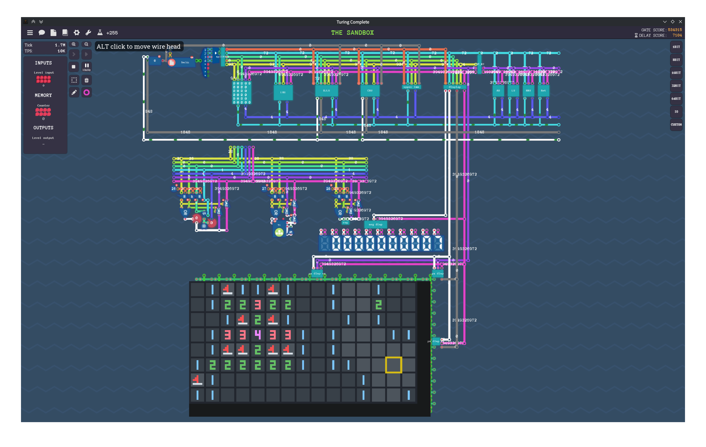
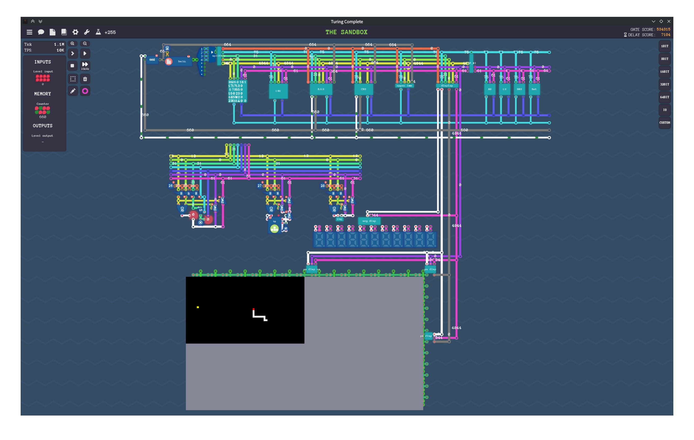

# ArchP

A simple instruction set architecture (ISA) that operates within the game [Turing Complete](https://store.steampowered.com/app/1444480/Turing_Complete/).

This repository contains its corresponding assembler.

## Pictures

[](./examples/minesweeper.asm)
[](./examples/snake.asm)

## CLI Usage

```
Assembly implementation of the ArchP ISA

Usage: archp_asmc [OPTIONS] [SRC_FILE]

Arguments:
  [SRC_FILE]  File path to the source assembly file

Options:
      --complete <COMPLETE>  Print shell auto completions for the specified shell [possible values: bash, elvish, fish, powershell, zsh]
  -o, --output <OUTPUT>      The output file path [default: <stdout>]
      --bin                  Output binary machine code instead of formatted hex
      --disable-macro        Disable the macro-instructions
  -h, --help                 Print help
  -V, --version              Print version
```

## Assembly Syntax

- Comments start with `#` or `;` and continue to the end of the line.
- Definite constants using `const` directive: `const NAME VALUE` (only allowed at the beginning of the file).
- Labels are defined by writing the label name followed by a colon (`:`) at the beginning of a line.
- Operands are separated by spaces or tabs (not `,`).
- Instructions and labels are case-insensitive.
- Only one instruction or label definition is allowed per line (label and instruction can be on the same line).
- See [examples](./examples) for more details.

## Schematics

> [!NOTE]
> The schematic may not be the latest version; please check the commit list to locate the most up-to-date implementation.  
> Alternatively, you may just get a fixed version from the git tags.

See [assets/schematics](./assets/schematics).

## ISA

This section is intended for users.
If you require detailed information on the encoding formats, please refer to [isa.txt](./isa.txt).

### Registers

- 24 general-purpose registers: `r1` to `r24`.
- special registers:
  - `r0`: always contains 0, you can write to it but it has no effect.
  - `pc`: program counter (read-only).
  - `io`: the level input/output (only in level mode).
  - `kb`: the keyboard input (only in sandbox mode, read-only).
  - `rng`: the random number generator (read-only).
  - `tmp`: used by the assembler for expanding macro-instructions.

### Instructions

In this section:

- `instr`: the instruction name.
- `cond`: optional condition code (see [Conditions](#conditions)).
- `rd`: the destination register.
- `rs1`: the first source register.
- `rs2`: the second source register.
- `imm12`: 12-bit signed immediate value, from `-2048` to `2047`.
- `immX`: will be specified in the instruction description.
- numeric literal: `42`, `-7`, `0b010101`, `0xFE42`, etc.

> [!NOTE]
> The 'signed' and 'unsigned' are merely formal distinctions,
> you can always use `0xFFFFFFFE` (or `0xFFE` in 12 bits) to represent `-2`.

> [!NOTE]
> The `macro` features are enabled by default.
> You can disable them using the `--disable-macro` option when invoking the assembler.

#### Arithmetic

- instructions:
  - `add`, `sub`, `mul`, `mulh`, `mulhu`, `mulhsu`, `div`, `mod`
  - `addi`, `subi`, `muli`, `mulhi`, `mulhui`, `mulhsui`, `divi`, `modi`
- format: `instr[.cond] rd rs1 rs2/imm12`
- macros:
  - When using register series instructions, if the third operand is a numeric literal, it will be automatically replaced with an immediate series instruction.
  - When using immediate series instructions, if the immediate is larger the 12-bit, it will be automatically expanded into multiple instructions to load the immediate into a temporary register first.
  - e.g. `sub r1 r2 0x1234` => `subi r1 r2 0x1234` => `lui tmp 0x1; addi tmp tmp 0x234; sub r1 r2 tmp`

#### Logical

- instructions:
  - `and`, `or`, `xor`, `nand`, `nor`, `xnor`, `not`
  - `andi`, `ori`, `xori`, `nandi`, `nori` `xnori`
- format: `instr[.cond] rd rs1 rs2/imm12` or `not[.cond] rd rs1`
- macros: Same as [Arithmetic](#arithmetic) instructions.

#### Shift and Rotate

- instructions: `shl`, `shr`, `rol`, `ror`, `ashr`, `shli`, `shri`, `roli`, `rori`, `ashri`
- format: `instr[.cond] rd rs1 rs2/imm5`, where `imm5` is a 5-bit unsigned immediate value from `0` to `31`.
- macros: Same as [Arithmetic](#arithmetic) instructions.

#### Comparison

- instructions: `cmp`, `cmpi`
- format: `instr[.cond] rs1 rs2/imm12`
- macros: Same as [Arithmetic](#arithmetic) instructions.

#### Load and Store

- `lw[.cond] rd rs1 imm12`: load word from memory address `rs1 + imm12` into `rd`.
- `sw[.cond] rs1 rs2 imm12`: store word from `rs2` into memory address `rs1 + imm12`.
- `li[.cond] rd imm12`: load immediate value `imm12` into `rd`.
- `lui rd imm20`: load upper immediate value `imm20` (20-bit unsigned) into the upper 20 bits of `rd`, setting the lower 12 bits to 0.
- macros:
  - When using `li`, if the immediate is larger the 12-bit, it will be automatically expanded into multiple instructions to load the immediate into the destination register.
  - e.g. `li r1 0x123456` => `lui r1 0x123; addi r1 r1 0x456`
  - When using `lw` or `sw`, it allows you to use a RISCV-style offset syntax.
  - e.g. `lw r1 4(r2)` => `lw r1 r2 4`

> [!IMPORTANT]
> The unit of `imm12` in `lw` and `sw` is words (32-bit), not bytes.

> [!NOTE]
> If you are simulating the hardware stack using a stack pointer register (e.g. `const sp r10`),  
> remember to initialize it to point to the top of the stack memory region. (e.g. `li sp 4096`)  
> Example: [fib.asm](./examples/fib.asm)

#### Branching

- instructions: `beq`, `bne`, `blt`, `ble`, `bgt`, `bge`
- format: `instr[.cond] rs1 rs2 imm12u`, `jmp[.cond] imm12u`
  - `rs1` and `rs2` are the registers to compare.
  - `imm12u` is a 12-bit unsigned immediate value representing the absolute address in number of instructions (not bytes) to jump to.
- macros:
  - If the `rs2` operand is a numeric literal, it will be automatically expanded to use a temporary register.
  - A 32-bit immediate literal is also supported.
  - e.g. `beq r1 0x1234 10` => `lui tmp 0x1; addi tmp tmp 0x234; beq r1 tmp 10`

> [!IMPORTANT]
> You can not write `imm12u` directly as a numeric literal, you must use a label.
> The `imm12u`'s below are the same.

#### Stack Operations

- `push[.cond] rs1`: push the value of `rs1` onto the stack.
- `pop[.cond] rd`: pop the top value from the stack into `rd`.

#### Call and Return

- `call[.cond] imm12u`: call a subroutine at the address `imm12u` (absolute address in number of instructions).
- `callr[.cond] rs1`: call a subroutine at the address contained in `rs1` (low 16-bit is valid).
- `ret[.cond]`: return from the current subroutine.
- note:
  - The return address is automatically managed by the hardware stack.

#### Jump and Link

- `jal[.cond] ra imm12u`: jump to the address `imm12u` (absolute address in number of instructions) and write the return address into `ra`.
- `jalr[.cond] ra rs1`: jump to the address contained in `rs1` (low 16-bit is valid) and write the return address into `ra`.
- note:
  - You may know how to use this instruction if you are familiar with the RISC-V architecture.

#### Display (only in sandbox mode)

- `col imm24u`: set the display color to the 24-bit unsigned immediate value `imm24u` (format: `0xRRGGBB`).
- `spx[.cond] rs1 rs2`: set the `(rs1, rs2)` position to the color specified by the last `col` instruction.
- `seg[.cond] rs1`: display the value of `rs1` (as 8-bit unsigned) on a 7-segment display.
- `segi[.cond] imm8u`: display the 8-bit unsigned immediate value `imm8u` on a 7-segment display.

### Conditions

You can compare two registers using the `cmp` instruction, or `cmpi` to compare a register with an immediate value.
The result of the comparison is stored internally and can be used by conditional instructions.

- none: always execute
- `eq`: execute if last comparison was equal
- `ne`: execute if last comparison was not equal
- `lt`: execute if last comparison was less than
- `ge`: execute if last comparison was greater than or equal
- `gt`: execute if last comparison was greater than
- `le`: execute if last comparison was less than or equal

### Pseudo Instructions

- `mv rd rs1` => `addi rd rs1 0`
- `clr rd` => `li rd 0`
- `inc rd` => `addi rd rd 1`
- `dec rd` => `subi rd rd 1`
- `b**z rs1 imm12` => `b** rs1 r0 imm12` (e.g. `beqz`, `bnez`, `bltz`, etc.)

## References

- [ESnake37/Turing-Complete-Minesweeper](https://github.com/ESnake37/Turing-Complete-Minesweeper)
